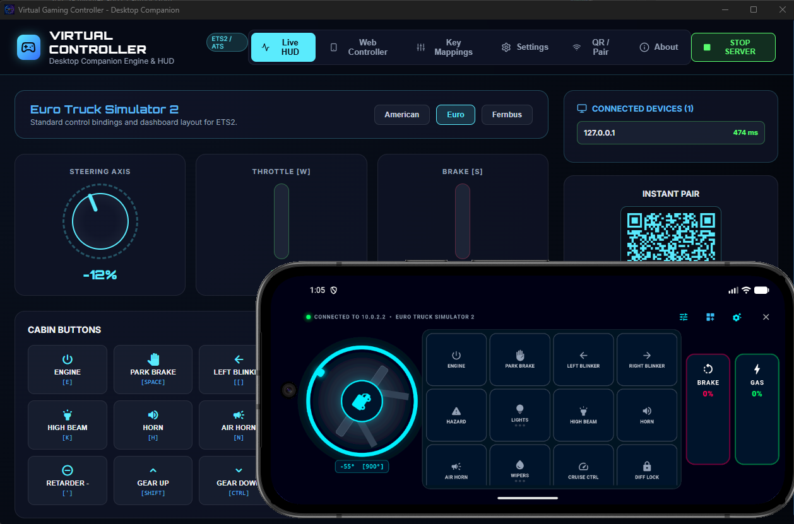

# 🎮 Virtual Gaming Controller (VGC)

[](LICENSE)
[](#)
[](#)

Turn your smartphone or tablet into a high-precision, low-latency steering wheel and button box controller for driving and simulation games like **Euro Truck Simulator 2 (ETS2)**, **American Truck Simulator (ATS)**, **Fernbus Coach Simulator**, **BeamNG.drive**, and **Assetto Corsa**.

<div align="center">
  
</div>

---

## 🌟 Key Features

- 🏎️ **Precision Steering Wheel**: Dynamic configurable rotation degrees (180° up to 1080°) with customizable wheel diameter and auto-centering spring physics.
- ⚡ **Ultra-Low Latency Binary Protocol**: Zero-allocation packed binary UDP network stream delivering sub-millisecond responsiveness with negligible CPU usage.
- 🚦 **Pro Linear Pedals**: Smooth throttle and brake pressure control sliders with return spring mechanics.
- 🔘 **Interactive Cockpit Matrix**: Fully customizable button grid with support for:
  - Momentary buttons (Push & Release)
  - Toggle switches (On/Off)
  - 3-Stage rotary style switches (Off ➔ White ➔ Amber ➔ Green)
  - Realistic synchronized vehicle logic (directional turn blinkers, hazard flasher, ignition engine control).
- 🔍 **Instant Host Auto-Discovery & QR Pairing**: Effortlessly connects your mobile device to your PC companion via UDP subnet beacons or instant live QR camera scan.
- 🖥️ **Lightweight Desktop Companion**: Electron/React HUD dashboard with a native Win32 input feeder and zero background process spamming.

---

## 🏗️ Project Architecture

```
virtual-gaming-controller/
├── desktop-companion/       # Electron & TypeScript companion engine with native input emulator
│   ├── src/                 # UDP server, discovery beacon & Win32 key feeder
│   └── src/renderer/        # React + Tailwind/Lucide HUD dashboard & QR generator
├── mobile-controller/       # Flutter application for Android & iOS
│   ├── lib/core/            # Binary UDP client, discovery listener & state models
│   └── lib/ui/              # Cockpit UI, dynamic wheel, pedals & custom button configurator
└── shared/                  # Default profile presets (ETS2, ATS, Fernbus)
```

---

## 🚀 Quick Start

### 1. Run the Desktop Companion
Make sure you have [Node.js](https://nodejs.org/) installed:

```bash
cd desktop-companion
npm install
npm run build
npm start
```
The desktop HUD will launch and broadcast its IP and port on your local network.

### 2. Run the Mobile Controller
Make sure you have [Flutter SDK](https://flutter.dev/) installed:

```bash
cd mobile-controller
flutter pub get
flutter run
```
On the home screen, select your discovered PC or scan the QR code displayed on the companion HUD, choose your game profile, and hit **START CONTROLLER**.

---

## 📜 License

This project is licensed under the **GNU Lesser General Public License v2.1 (LGPL-2.1)** — see the [LICENSE](LICENSE) file for complete details.

Copyright (C) 2026 **[Ashish Shetty](https://github.com/Shetty073)**
